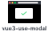

<p align="center">
  
</p>
<p align="center">
  <a href="https://npmjs.com/package/vue-use-modal"></a>
</p>
<br />

## 🎨 vue-use-modal 

`vue-use-modal` is vue3(vue-next) plugin that provide easy use of modal. It is not only component based but also lets using modal either **asynchronous or synchronous** behavior.

> 🚨 Caution: `vue-use-modal` is not compatitable with vue2.

## 🛠 Installation

```shell
# using npm
npm install use-modal

# using yarn
yarn add use-modal
```

## 📝 Setting in Vue3 

```javascript
import { ModalPlugin } from 'vue-use-modal';

createApp(App).use(ModalPlugin).mount('#app');
```

## 📝 Setting in Nuxt3

```javascript
// plugins/modalPlugin
import { ModalPlugin } from 'vue-use-modal';

export default defineNuxtPlugin((nuxtApp) => {
  nuxtApp.vueApp.use(ModalPlugin);
})
```

```javascript
// nuxt.config.js
module.exports = {
  plugins: [
    { src: '~/plugins/modalPlugin', mode: 'client' },
  ],
}
```

## 🏷 Type def

```typescript
import { useModal } from 'vue-use-modal';
// shims-vue.d.ts
declare module 'vue' {
  interface ComponentCustomProperties {
    $modal: ReturnType<useModal>
  }
}
```

## 🎩 Usage vue-use-modal

#### ⭐️ See example [here](https://github.com/eddie0329/vue-use-modal/tree/main/playground).

### 1> Define modal component:

```html
<template>
  <div class="modal-bg" />
  <div class="modal-content">
    <h1>Hello vue-use-modal</h1>
    <h2>{{ $props.options.name }}</h2>
    <button @click="$emit('resolve', 'eddie')">resolve</button>
    <button @click="$emit('reject', 'error')">reject</button>
    <button @click="$emit('close')">close</button>
  <div>
</template>
```

#### emit('resolve', value)

- Type:
``` typescript
type emit = ('resolve', value: any): void
```
- Description: 

#### emit('reject', value)
- Type:
``` typescript
type emit = ('reject', value: any): void
```
- Description:


#### emit('close')
- Type:
```typescript
type emit = ('close')
```
- Description:

### 2> useModal:

```html
<script setup lang="ts">
import { useModal } from 'vue-use-modal';
import SimpleModal from 'components/SimpleModal.vue';

const modal = useModal();

const onClick = async () => {
  const name = await modal.addModal<string>(
    { 
      key: 'SimpleModal', 
      component: SimpleModal,
      options: { name: 'eddie' }
    });
  alert(`My name is: ${name}`);
}
</script>
```

OR

```html
<script lang="ts">
import SimpleModal from 'components/SimpleModal.vue';

export default {
  methods: {
    async onClick() {
      const name = await this.$modal.addModal<string>(
        {
          key: 'SimpleModal',
          component: SimpleModal,
          options: { name: 'eddie' }
        });
      alert(`My name is: ${name}`);
    }
  },
}
</script>
```

#### modal.addModal()

- Type:
```typescript
type addModal<T> = ({ key: string, component: import('vue').Component, options?: any }): Promise<T>;
```

#### modal.closeModal()
- Type
```typescript
type closeModal = ({ key: string }): void;
```

## 🐛Report bug

Please report bug in issue tab with template.

## 🙇🏻‍️ Contribution

See [CONTRIBUTION.md](https://github.com/eddie0329/vue-use-modal/blob/main/CONTRIBUTING.md)
